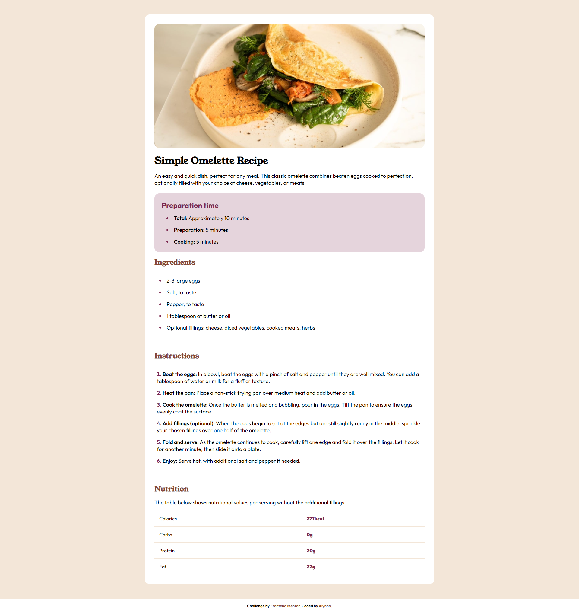
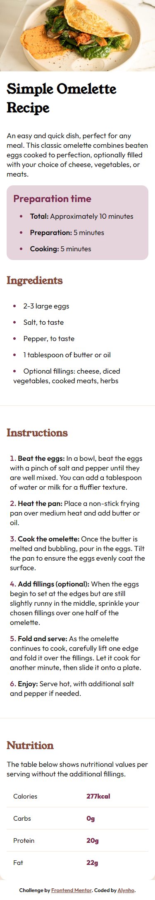

# Frontend Mentor - Recipe page solution

Esta é uma solução para o [Desafio da página de receitas no Frontend Mentor](https://www.frontendmentor.io/challenges/recipe-page-KiTsR8QQKm). Os desafios do Frontend Mentor ajudam você a melhorar suas habilidades de codificação ao construir projetos realistas.

## Table of contents

- [Overview](#overview)
  - [Screenshots](#screenshots)
    - [Desktop](#desktop)
    - [Mobile](#mobile)
  - [Links](#links)
  - [Feito com](#feito-com)
  - [O que aprendi](#o-que-aprendi)
  - [Ideias para o futuro](#ideias-para-o-futuro)
  - [Recursos úteis](#recursos-úteis)

## Overview

Essa é uma página de receitas, onde o usuário pode ver a receita, os ingredientes e o modo de preparo. A página é responsiva e foi feita com HTML e CSS e você pode ver todos os elementos que foram utilizados no código nesse repositório.

A página é um desafio do site Frontend Mentor, onde o usuário pode escolher entre diversos desafios para praticar suas habilidades de front-end.

### Screenshots

#### Desktop

<p align="center">
  
</p>

#### Mobile

<p align="center">
  
</p>

### Links

- Aqui você pode ver o [resultado](https://alynh0.github.io/recipe-page/).

### Feito com

- HTML5 Semântico
- CSS3
- Flexbox
- Mobile-first

### O que aprendi

Meus aprendizados com esse desafio foram principalmente no CSS, onde tiveram situações em que foi necessário buscar soluções para problemas que ainda não tinha enfrentado. O maior deles foi na tabela, onde tive que buscar uma maneira para que não tivesse uma borda no último item da lista, e assim o fiz:

```css
.nutrition tr:last-child {
  border-bottom: none;
}
```

Foi a primeira vez que utilizei o `:last-child` e foi muito útil para resolver esse problema. Agora tendo aprendido, posso utilizar em outros projetos.

Outro aprendizado que tive foi com o `:not`, que foi utilizado para adicionar um espaçamento entre os elementos da receita, exceto no primeiro, onde foi utilizado o seguinte código:

```css
.recipe > *:not(:first-child) {
  padding: 1rem;
}
```

### Ideias para o futuro

Durante o desenvolvimento desse desafio, tive a ideia de, futuramente, refatorar todo o código utilizando algum framework Front-end para que tudo fique componentizado e mais organizado. Além disso, pensei também em produzir uma API para que as receitas sejam dinâmicas e possam ser adicionadas e removidas através de um banco de dados.

### Recursos úteis

- [MDN - :not](https://developer.mozilla.org/pt-BR/docs/Web/CSS/:not) - Este artigo me ajudou a entender como o `:not` funciona e como utilizá-lo. Utilizei para adicionar um espaçamento específico entre os elementos da receita na página quando em dispositivos móveis.
- [MDN - :first-child](https://developer.mozilla.org/pt-BR/docs/Web/CSS/:first-child) - Este artigo me ajudou a entender como o `:first-child` funciona e como utilizá-lo. Nesse projeto em específico não fiz o seu uso, mas foi um aprendizado que tive e que pode ser útil em projetos futuros.
- [MDN - :last-child](https://developer.mozilla.org/en-US/docs/Web/CSS/:last-child) - Este artigo me ajudou a entender como o `:last-child` funciona e como utilizá-lo. Utilizei para remover a borda do último item da tabela de ingredientes.
